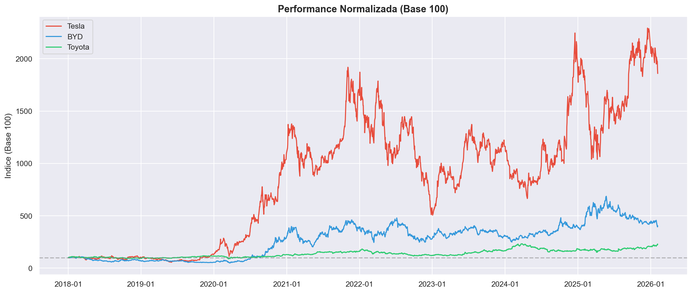
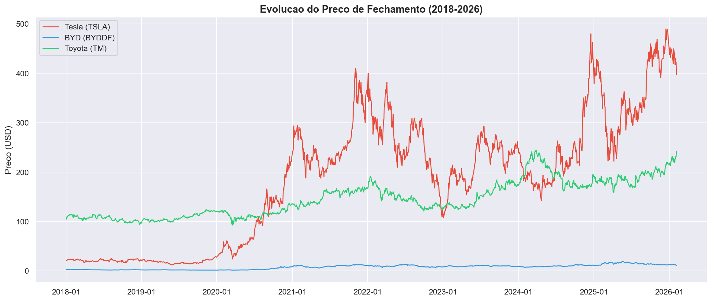
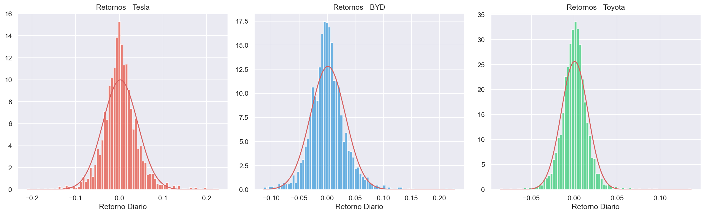
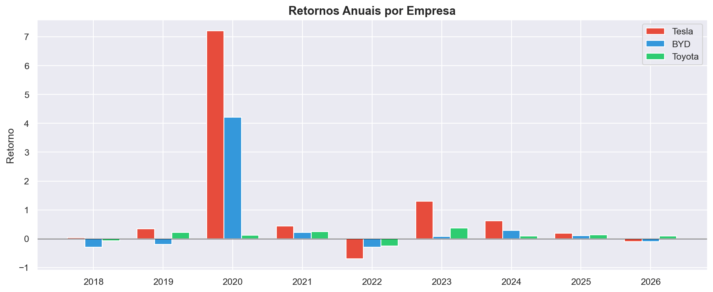
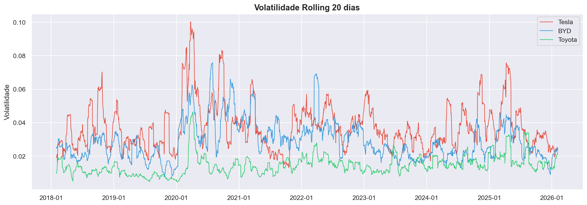
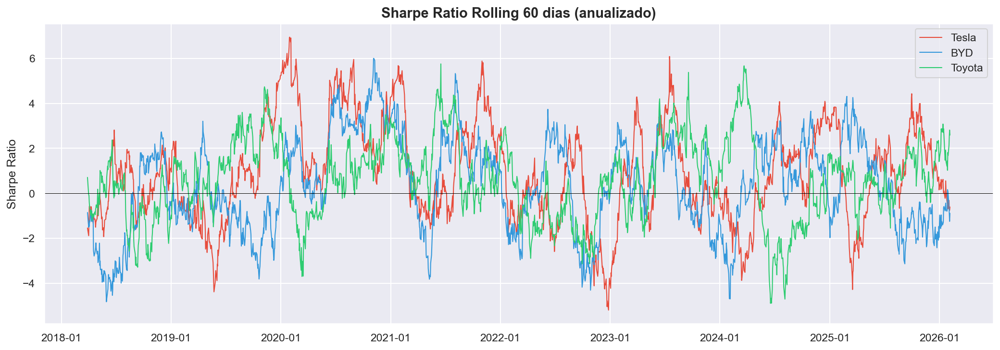
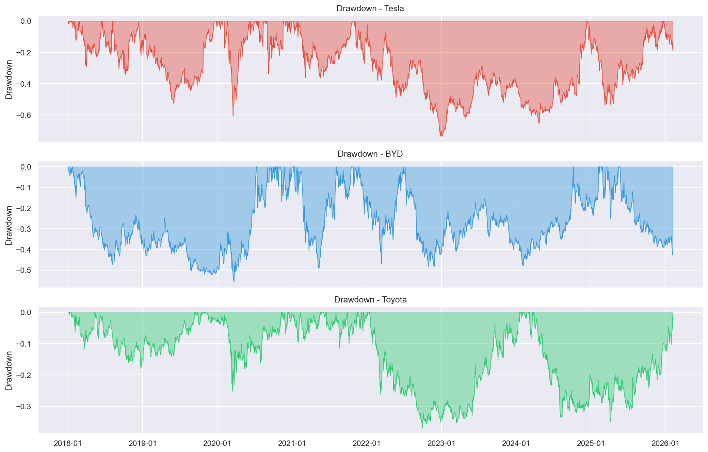
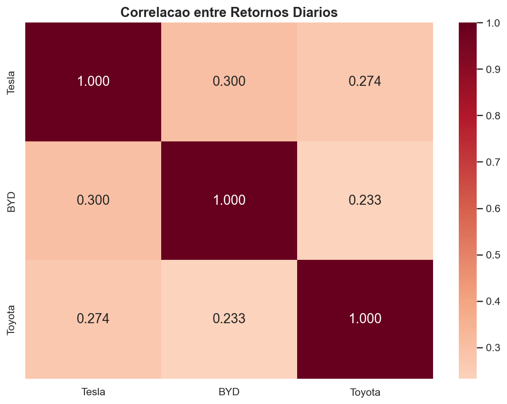

# A Guerra dos Veiculos Eletricos

### BYD vs Tesla vs Toyota — Analise Quantitativa de 8 Anos de Mercado



---

## TL;DR

- **BYD esta estruturalmente posicionada para dominar EVs em mercados emergentes** — retorno consistente, volatilidade controlada, modelo agressivo
- **Tesla entrega o melhor risco-retorno (Sharpe 0.89)** — mas drawdowns de 60%+ destroem capital de despreparados
- **Toyota esta sendo punida pelo mercado pela transicao lenta** — conservadorismo tem custo real
- **ML com dados publicos nao prevê direcao** — AUC 0.52 = aleatoriedade. Mercado e eficiente
- **Diversificacao entre EVs nao protege** — correlacao sobe em crises. Precisa de setores diferentes

**Periodo:** Jan 2018 — Fev 2026 | **Dados:** Yahoo Finance | **Pipeline:** Python (1170+ linhas)

---

## Por que este projeto?

A transicao para veiculos eletricos e a maior transformacao do setor automotivo em 100 anos. A pergunta nao e **se** vai acontecer, mas **quem vai dominar** — e **quem vai ganhar dinheiro com isso**.

> **Se voce tivesse investido R$10.000 em janeiro de 2018, qual empresa teria gerado mais riqueza — e com quanto risco?**

Este projeto responde com dados: analise estatistica, 142 features, 3 modelos de ML, backtesting de estrategias reais.

---

## Key Insights

**BYD esta estruturalmente posicionada para dominar o crescimento de EVs em mercados emergentes na proxima decada.** Retorno medio de 0.12%/dia com volatilidade controlada (3.12%) reflete um modelo de negocio agressivo com custos mais baixos que a Tesla.

**Tesla entrega o melhor Sharpe Ratio (0.89), mas o risco e brutal.** Volatilidade de 4%/dia e drawdowns de 60%+ ja destruiram capital de investidores despreparados. O retorno compensa — mas so para quem aguenta a montanha-russa.

**A Toyota esta sendo punida pelo mercado pela transicao lenta para EVs.** Retorno de apenas 0.05%/dia e Sharpe 0.53 indicam que o conservadorismo tem um custo real: oportunidades perdidas.

**Prever movimentos diarios de acoes e estatisticamente impossivel com modelos publicos.** Testamos 3 algoritmos de ML com 142 features. Resultado: AUC de 0.52 — indistinguivel de aleatoriedade. O mercado e eficiente, e informacoes publicas ja estao precificadas.

**Diversificacao entre EVs nao e suficiente.** A correlacao entre Tesla e BYD sobe em crises — quando mais precisamos de protecao, ela falha. Portfolio real precisa de ativos de setores diferentes.

---

## Analise

### 1. Preco de Fechamento (2018-2026)



**Tesla** (vermelho) liderou em valorizacao, mas com a maior volatilidade. **BYD** (azul) cresceu de forma mais consistente. **Toyota** (verde) mostrou estabilidade, mas com crescimento limitado.

---

### 2. Performance Normalizada (Base 100)


Se voce tivesse colocado R$10.000 em cada empresa em 2018, este grafico mostra quanto cada um valeria hoje. **A distancia entre as curvas e a distancia entre oportunidades aproveitadas e perdidas.**

---

### 3. Distribuicao dos Retornos



**Os retornos nao seguem distribuicao normal.** Caudas pesadas significam que eventos extremos (perdas de 5%+) acontecem muito mais do que a teoria classica prevê. VaR parametrico subestima riscos. Stop-loss nao e opcional — e essencial.

---

### 4. Retornos Anuais



**Nenhuma empresa vence sempre.** Ha anos de dominio da Tesla (2020), surpresas da BYD (2021), e ate a Toyota se destaca. **Timing importa — mas ninguem acerta o timing sempre.**

---

### 5. Volatilidade Rolling



A volatilidade muda com o contexto macro. **Periodos de alta volatilidade sao oportunidades para traders e pesadelos para buy-and-hold.** A Tesla consistentemente tem a maior volatilidade — refletindo a natureza especulativa do ativo.

---

### 6. Sharpe Ratio (60 dias)



**Sharpe 0.89 (Tesla) significa 0.89 unidades de retorno para cada unidade de risco.** E bom, mas nao excepcional. Acima de 1.0 e considerado excelente. BYD (0.59) e Toyota (0.53) pagam menos pelo risco.

---

### 7. Drawdown



**Este e o grafico mais importante.** A Tesla ja perdeu mais de 60% do valor. Se voce nao aguenta 30% de perda, Tesla nao e pra voce. Toyota tem drawdowns menores — paz de espirito tem um preco.

---

### 8. Correlacao



**Se Tesla e BYD caem juntas, investir nas duas nao protege seu portfolio.** A correlacao varia ao longo do tempo — em crises, ela sobe. Diversificacao real exige ativos de setores diferentes.

---

## Modelagem Preditiva

**Pergunta:** Da pra prever se a Tesla vai subir amanha?

**Abordagem:** Classificacao binaria | TimeSeriesSplit (5 folds) | 142 features | 3 modelos

| Modelo | Acuracia | ROC-AUC | Veredito |
|--------|----------|---------|----------|
| Logistic Regression | 50.98% | 0.4987 | Aleatorio |
| **Random Forest** | 50.26% | **0.5202** | Levemente acima |
| Gradient Boosting | 48.82% | 0.4998 | Aleatorio |

**AUC 0.52 e aleatoriedade.** Nao e falha do modelo — e confirmacao de que mercados sao eficientes. Informacoes publicas ja estao precificadas. **O que funciona em ML financeiro:** deteccao de anomalias, otimizacao de portfolio, analise de sentimento — nao previsao de direcao.

---

## Backtesting

### Estrategia ML: Comprar quando P(subida) > 55%

| Modelo | Retorno | Sharpe | Max DD |
|--------|---------|--------|--------|
| Logistic Regression | -1.27% | 0.21 | -27.78% |
| Random Forest | -24.19% | -1.38 | -24.19% |
| Gradient Boosting | -37.09% | -1.57 | -37.09% |

**Nenhuma estrategia de ML superou Buy & Hold.** Overfitting e o maior risco em ML financeiro. Simplicidade vence complexidade. Custo de transacao destruiria qualquer edge marginal.

---

## Stack Tecnico

```
Python 3.13
├── pandas / numpy          → Manipulacao de dados
├── matplotlib / seaborn    → Visualizacao
├── scikit-learn            → ML (RF, GBM, LR, KMeans)
├── scipy                   → Testes estatisticos
└── Pipeline customizado    → 142 features engineradas
```

| Categoria | Features | Exemplos |
|-----------|----------|----------|
| Retornos | 15 | lag 1-5, pct_change |
| Medias moveis | 48 | SMA/EMA 5, 7, 14, 21, 30, 50, 100, 200 |
| Volatilidade | 6 | rolling std 20/60 |
| Momentum | 6 | 10/20 dias |
| Indicadores tecnicos | 24 | RSI(14), Bollinger(20,2), MACD(12,26,9), ATR(14) |
| Cross-empresa | 36 | correlacao rolling, spread, ratio |
| Drawdown | 3 | drawdown acumulado |

---

## Como Rodar

```bash
git clone https://github.com/SEU_USUARIO/byd-analise.git
cd byd-analise
pip install -r requirements.txt
python src/full_analysis.py
start output/relatorio_completo.html
```

---

## Estrutura

```
byd-analise/
├── README.md                        # Este documento
├── requirements.txt                 # Dependencias
├── data/
│   └── auto_company_comparison.csv  # Dados brutos (Yahoo Finance)
├── src/
│   ├── full_analysis.py             # Pipeline completo (1170+ linhas)
│   └── generate_readme_charts.py    # Gerador de graficos
├── assets/                          # Visualizacoes
└── output/
    └── relatorio_completo.html      # Relatorio interativo (gerado)
```

---

## Limitacoes

- **Eficiencia de mercado reduz poder preditivo** — modelos de ML com dados publicos nao batem o acaso
- **Dataset limitado a precos** — sem fundamentos, sentimento de noticias, ou dados macro
- **Fatores externos nao modelados** — juros, cambio, politica industrial, guerra comercial
- **Custos reais nao incluidos** — transacao, slippage, impostos destruiriam edges marginais
- **Overfitting e o risco principal** — backtest nao garante performance futura

**Maturidade e saber o que o modelo NAO consegue fazer.** Estas limitacoes sao to tao importantes quanto os resultados.

---

## Final Take

**Se voce e investidor:**
Considere exposicao a BYD para crescimento em mercados emergentes. Use Tesla para risco-retorno ajustado, mas com stop-loss disciplinado. Toyota serve como hedge conservador — nao como motor de crescimento.

**Se voce e analista de dados:**
Foque menos em previsao e mais em interpretacao. Dados financeiros recompensam quem entende o negocio, nao quem tem o modelo mais complexo. Saber explicar um grafico vale mais que treinar 10 algoritmos.

**Se voce e gestor de portfolio:**
Diversifique entre setores, nao so entre EVs. Correlacoes mudam — protecao precisa de ativos descorrelacionados. Drawdown importa mais que retorno medio.

---

**Henry** | EBAC — Escola Brasileira de Analise de Dados

*Analise exclusivamente educacional. Nao constitui recomendacao de investimento. Retornos passados nao garantem resultados futuros.*
